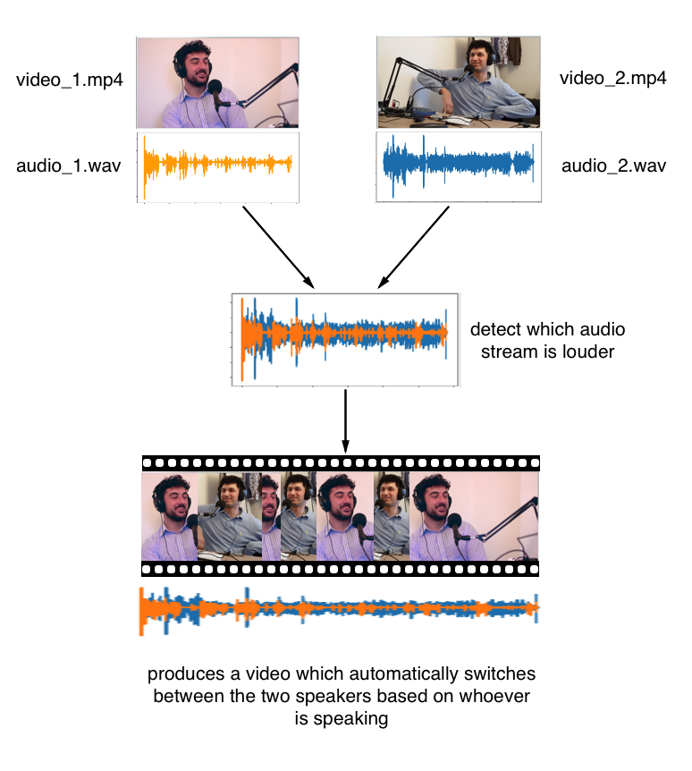

You can see examples of videos produced through this process by clicking [here](https://www.youtube.com/watch?v=pdIJO2LIIog&t=6s)

This is a quick set of scripts to allow you to automatically cut between two camera angles, based on which person is speaking more loudly.

Run `./start.sh video_1.mp4 audio_1.wav video_2.mp4 audio_2.wav combined.wav`

Depending on how large the files are, this may take some time. The end result will be that it produces 3 files:
- mute.mp4 -> just the video with cuts, no audio
- output.mp4 -> cut video with the original audio (audio for each video file)
- combined.mp4 -> cut video with `combined.wav` overlayed as the audio over the video. Occasionally this does not work because the audio and video get out of sync over time.

Below are the more detailed steps on what is actually happening:
Runs `python3 generate_cuts.py  video_1.mp4 audio_1.wav video_2.mp4 audio_2.wav` to create a `cuts.json` file. This contains only the information telling you which video clip to cut to. It is created using only the audio information. Whoever is speaking louder will be cut to next.

Creates a directory called "subclips" then run `./generate_clips.sh`. You will need to have a `cuts.json` file, and you will need to make sure the filenames in that file point to valid locations (typically `data/awais.mp4` or something similar).

Creates a folder called `formatted` and then runs `./format_clips.sh` to encode all the video files in the same format. This is necessary if the videos ahave different frame rates etc.

Runs `python3 generate_subclips_txt.py` to add padded zeros to the formatted subclip file names so they will be alphabetical. This will also generate a `subclips.txt` file.

Finally runs `export_file.sh`. This will produce an `output.mp4`, then a `mute.mp4` file (which has no audio), and finally a `combined.mp4` file, which contains the full video with the combined audio file.

